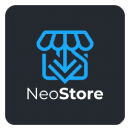

# NeoStore Documentation



## Introduction

NeoStore is a full-featured web-based app store for NeoOS, designed for both consumers and developers. This documentation covers installation, usage, repository management, app publishing, and developer-specific integration with GitHub Actions.

---

## Consumer Guide

### Navigating the Store
- Open NeoStore on your NeoOS device.
- Use the sidebar to browse categories or search for apps.
- Apps are displayed in a grid for easy browsing.

### Installing Apps
- Select an app to view details, including icon, version, and description.
- Press **Install** to download and install the application.

### Repository Management
- Access **Repository Management** via the sidebar.
- Add new repositories by entering the URL and clicking **Add**.
- Manage existing repositories in the installed list.

### Features for Users
- App Discovery in a grid layout.
- Integrated search functionality.
- Detailed app views with icon, version, and description.
- One-click installation.
- Modern, responsive UI.

---

## Developer Guide

### GitHub Actions Integration
NeoStore supports automated publishing via GitHub Actions. Follow these steps to publish your apps:

#### Step 1: Enable Repository Write Permissions
1. Go to **Settings → Actions → General**.
2. Under **Workflow permissions**, select **Read and write permissions**.
3. Save changes.

#### Step 2: Release Naming
- **Tag format:** `com.domain.myapp/version` (e.g., `com.neoos.weather/1.2.4`)
  - Important: Do not prefix the version with `v` and avoid spaces.
- **Release title:** Human-readable app name (e.g., `NeoOS Weather`).
- **Assets:** Upload `.ipk` application file and PNG logo (e.g., `icon.png`).
- **Release description:** Use Markdown formatting for clear app details.

#### Step 3: GitHub Action Example
```javascript
const jsonString = JSON.stringify(storeApps, null, 2);
const path = 'app_index.json';

let sha;
try {
  const { data: fileData } = await github.rest.repos.getContent({
    owner: context.repo.owner,
    repo: context.repo.repo,
    path: path,
    ref: 'refs/heads/main'
  });
  sha = fileData.sha;
} catch (e) {
  // File doesn't exist yet
}

await github.rest.repos.createOrUpdateFileContents({
  owner: context.repo.owner,
  repo: context.repo.repo,
  path: path,
  message: 'Anwendungs-Index automatisch aktualisiert [skip ci]',
  content: Buffer.from(jsonString).toString('base64'),
  branch: 'main',
  sha: sha
});
console.log("Die app_index.json wurde erfolgreich ohne Git-CLI aktualisiert!");
